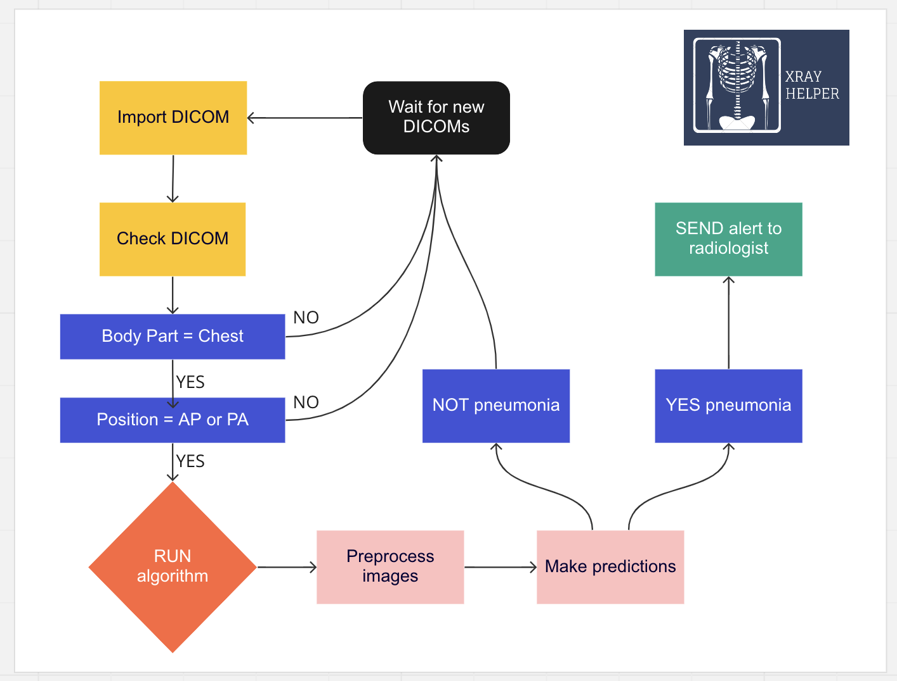
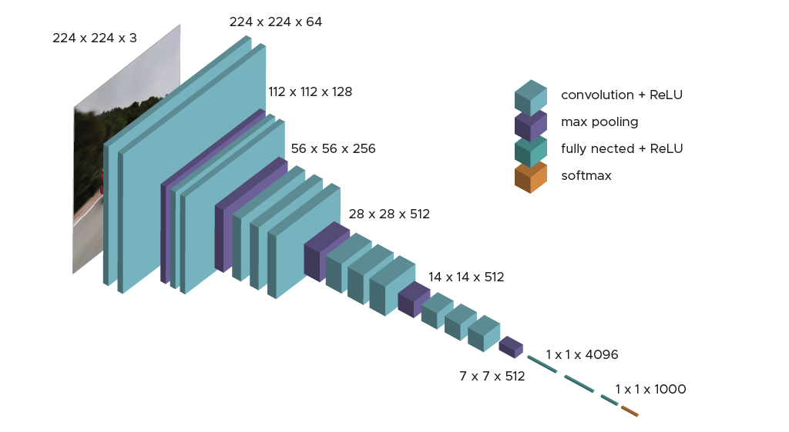
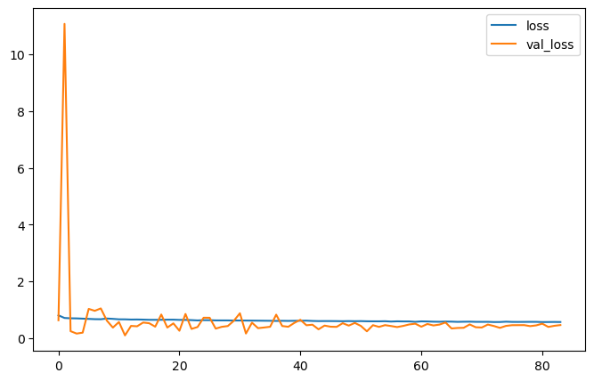
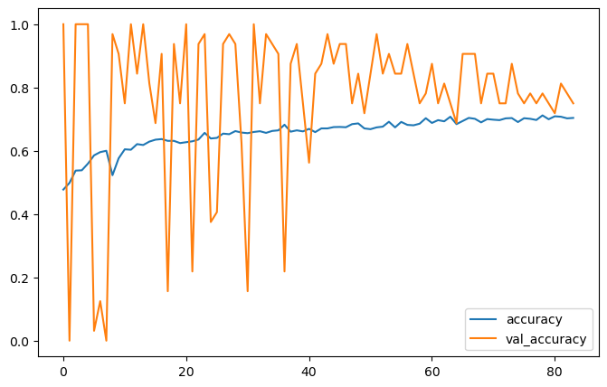
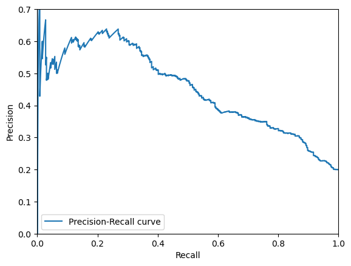
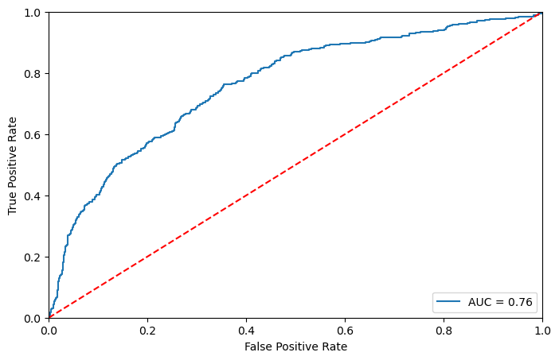
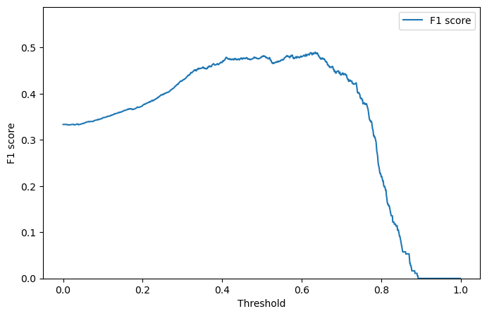
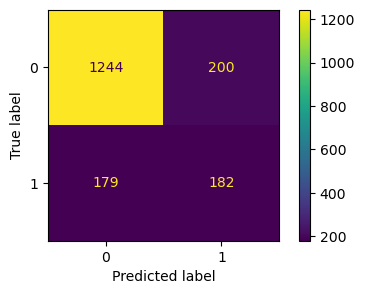
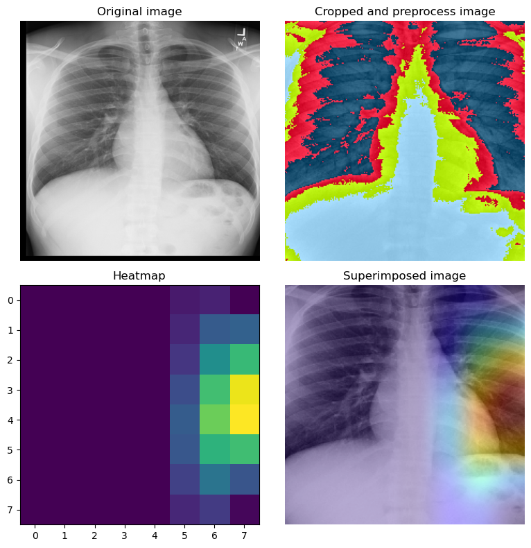

# FDA  Submission

**Your Name:** Maico Bernal

**Name of your Device:** XRAY-Helper

## Algorithm Description 

### 1. General Information

**Intended Use Statement:** 

Assist radiologists in the detection of pneumonia on X-ray chest images.
This is an AI based algorithm intended to be used only under the supervision of an expert physician.
It is desinged as a suplementary tool for assisting the physician and reduce it's workload and burnout rates.

**Indications for Use:**

Patients with suspected pneumonia, also know as lower lung infection.

Following conditions must be fullfilled in order to use XRAY-Helper:

- Patients from both sexs between 10 and 90 years old living in the United States of America. 
- Image taken from anteroposterior or posteroanterior proyection. 
- Patients in the outpatient and inpatient hospital enviroment.
- Patient must be free from radiopaque materials whenever clinically possible. 

**Device Limitations:**
- The XRAY-helper algorithm does not achieve 100% accuracy. It is therebefore only intented to be used as a supplementary diagnosis tool.
- The final diagnosis should always be compiled by an expert physician, like a radiologist.
- The software should be run on a device with proper hardware specifications, specially with GPU support to achieve faster predictions. Not following these requeriments could lead to potential delays in the workflow and patient assistance. 

**Clinical Impact of Performance:**

- Optimize the radiologist workflow by providing a fast pneumonia detection tool. Chest rays detected by the algorithm can be prioritized by the radiologist in order to make a final assesment more quickly and provide with a quick diagnosis to the attendand clinician.
- Software will make alerts for the radiologist when pneumonia is detected to be confirmed as soon as possible. 
- Fastest diagnosis can make treatment for the right patient faster. 
- The algorithm is designed to minimize the rate of false negatives in order to achieve a better outcome. 

### 2. Algorithm Design and Function

**DICOM Checking Steps:**

Algorithm will check for every new DICOM for Chest X-rays in position AP or PA. If both happen, it will send the image to make predictions.

**Preprocessing Steps:**

-Rescale images to resolution 224x224 pixels that the algorithm needs as input. 
-Convert grayscale images to RGB, as needed by the algorithm to 224x224x3. 
-VGG16 specific preprocessing steps

**CNN Architecture:**

VGG 16 was proposed by Karen Simonyan and Andrew Zisserman of the Visual Geometry Group Lab of Oxford University in 2014 in the paper “VERY DEEP CONVOLUTIONAL NETWORKS FOR LARGE-SCALE IMAGE RECOGNITION”. This model won 1st  and 2nd place in the above categories in the 2014 ILSVRC challenge. 

This model achieves 92.7% top-5 test accuracy on the ImageNet dataset which contains 14 million images belonging to 1000 classes. 

- VGG-16 model schema: 

Using a transfer learning approach with Keras implementation of VGG16 imagenet as base model, last convolutional block and last dense layer of the original network was deleted and replaced with the following additional layers:

- One block of three convolutional layers with 10x10, 8x8 and 6x6 kernels and 512 filters, followed by a BatchNormalization and GlobalAverage2DPolling to connect with dense layers. 
- Dense fully connected layer with 1024 nodes and ReLu activation, with dropout of 40%.
- Dense fully connected layer with 512 nodes and ReLu activation, with dropout of 30%.
- Dense fully connected layer with 256 nodes and ReLu activation, with no dropout. 
- Dense fully connected layer with 1 node and sigmoid activation as a final output for binary classification.

**Model plot:**

There was in total 14,161,921 trainable parameters. 

The model was trained on a MacBook Pro with M2 Apple Silicon Chip with 8GB RAM using Tensorflow Metal Plugin developed by Apple for GPU support. 

Total time of training 120 minutes for 84 epochs, stopped because no validation loss improvement founded after 10 epochs after a initial warm period of 70 epochs. 

### 3. Algorithm Training

**Parameters:**

* Mandatory preprocessing for training and validation sets: 
-VGG16 preprocessing function
-Center crop, in order to remove 20% of the borders of the image for excluding any digital annotation, arrows, wires, or devices that usually appears in the peripheria of the adquisition. 

* Types of augmentation used exclusively during training
-Standarized preproccessing for VGG-16 CNN  
-Horizontal flip
-Shift range 20% for height and width
-Rotation range 15 degrees
-Zoom range 20%
-Shear range 10%

* Batch size: 32
* Optimizer learning rate: Initial Adam 0.001 with 50% reduction if no improvement in validation loss for 5 epochs.  
* Layers of pre-existing architecture that were frozen: First 3 blocks of convolutional layers of VGG-16.
* Layers of pre-existing architecture that were fine-tuned: Block number 4 of convolutional layers. 
* Layers added to pre-existing architecture:
-3 convolutional layers of 10x10,8x8 and 6x6 kernel size with 512 filters. 
-3 fully connected dense layers of 1024, 512 and 256, with dropout rates of 40% and 30% for the first two layers.  

* Model perfomance: loss plot
     
* History plot for loss:

* History plot for accuracy:

* Precision-recall curve:

* AUC-ROC curve:

**Final Threshold and Explanation:**

The goal was to minimize false negatives predictions looking for the maximum F1 score (harmonic mean of recall and precision).

* F1 score vs threshold plot: 

* Final statistics:
**Threshold selected: 0.634**
**Recall: 0.50**
**Precision: 0.48**
**Specificity: 0.86**
**Accuracy: 0.79**
**F1 Score: 0.49**

* Confussion matrix: 

Also to remark, specificity 86% makes the algorithm a useful tool to exclude pneumonia in the clinical setting in which was evaluated and trained. 

### 4. Databases
XRAY-Helper was trained with a subset of the National Institute of Health (NIH) X-Ray dataset, which is a public dataset of 112120 chest xrays from 30805 unique patients with up to 15 different labels for common radiological findings, including pneumonia. 
Unbalanced adjustment and dataset filtering was needed as only 1.3% of the dataset was labeled as pneumonia and pneumonia was frequently associated with other common radiological findings, specially infiltration, consolidation and edema.  

**Description of Training Dataset:** 
Calculations for split and train where done taking into consideration rate of pneumonia for each dataset. 

- Train database = 50% non pneumonia vs 50% pneumonia, randomly selecting 50% of non pneumonia patients from the overall dataset. Total patients for train set: 2138 patients. 
- No data leakeage - only 928 unique patients with pneumonia. No patient ID from train set matches test set patient ID. 
- Train/test split done with stratification for sex and position. 
- Visual inspection done for checking that no residual unbalance persist after splitting for every feature. 

Please refer to EDA.ipynb notebook for graphic visualization of overall population, pneumonia population and pixel assesment for different radiological findings. 

**Description of Validation Dataset:** 
- Test database = 80% non pneumia vs 20% pneumonia, as expected to happen in a real clinical setting. Total patients: 1805. 
- No data leakeage - only 928 unique patients with pneumonia. No patient ID from train set matches test set patient ID. 
- Train/test split done with stratification for sex and position. 
- Visual inspection done for checking that no residual unbalance persist after splitting for every feature. 

Please refer to MODEL.ipynb notebook for graphic visualization of overall population, pneumonia population for validation dataset. 

**Example of GRAD-Cam map activation for a sample with pneumonia:**

### 5. Ground Truth
The ground truth (labels) was created by the NIH team with NLP tools of radiology reports, reporting a accuracy of ~90% for labeling. 
Limitations to take into consideration refers also to the fact that chest x-rays represent a picture of a continuous biological process (as is a lower lung infection like pneumonia). This makes the accuracy of a radiologist limited depending on certains conditions which may lead to a non-radiological expression of this pathologhy (like inmunosupression), leading to a missdiagnosis. 
Overall, the chest xray accuracy for detecting this specific pathology is limited, as stated in the [CheXNet original publication](https://arxiv.org/pdf/1711.05225.pdf) the average reported F1 score (harmonic mean of recall and precission) for pneumonia detection by a radiologist is 0.387 *CI95% (0.330, 0.442).* 
All these limitations, specially in data labeling, translate directly to the perfomance of the algorithm training. 

### 6. FDA Validation Plan

**Patient Population Description for FDA Validation Dataset:**

It is mandatory to have a clinical partner to validate the results and performance of the algorithm in real clinical practice. A requisite for this will be to include patients that match the NIH chest X-ray dataset's demographics and where prevalence of pneumonia disease in the current clinical setting is around 20% for this specific population. 

Following conditions must be fullfilled:

- Patients from both sexs between 10 and 90 years old living in the United States of America. 
- Image taken from anteroposterior or posteroanterior proyection. 
- Patients in the outpatient and inpatient hospital enviroment.
- Patient must be free from radiopaque materials whenever clinically possible. 
- Pneumonia prevalence of 20% in the real clinical setting. 

**Ground Truth Acquisition Methodology:**

A silver standard approach is the most affordable and clinically viable. Gathering a group of radiologist experts to independently label the new images for the presence of pneumonia and taking the majority vote for each image will be considered the ground truth. 
A gold standard approach would be to make a computer tomography scan and probably combinate that information with clinically relevant information like bronchoalveolar sample of tissue or microbiological culture. This process would be very time-consuming and would implicate potential damages for the patients for the risks associated by gamma radiation exposure and invasive procedures, it only could be applied to a subset of the population, regarding the aproval of the ethics commitee. 

**Algorithm Performance Standard:**

As stated above, the clinical perfomance of pneumonia detection for convolutional neural networks approach is around 0.387 and previous reports from CheXNet state a F1 score of 0.435 with the silver standard approach. 

The XRAY-helper software solution has achieved a F1-score of 0.490, outperforming expert radiologist perfomance. Even is used as a suplementary tool for diagnosis support, it will empower and accelerate the radiologist diagnosis. 